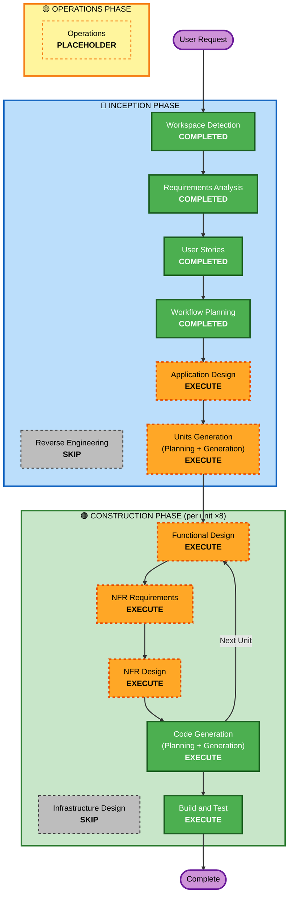

# Execution Plan — AnestIA

## Detailed Analysis Summary

### Project Type
Greenfield build over a fully specified domain (PRD v1.7 + schema.prisma + domain docs). No legacy app code → Reverse Engineering skipped.

### Change Impact Assessment
- **User-facing changes**: Yes — anesthesiologist panel, patient form, recipient download (3 personas).
- **Structural changes**: Yes — full new architecture (Angular + Next.js API + Prisma + pg-boss + adapters).
- **Data model changes**: Yes — 14 Prisma models to instantiate + migrate.
- **API changes**: Yes — all endpoints new (`app/api/**`).
- **NFR impact**: Yes — performance targets, security (Ley 1581, enabled Security extension), PBT extension.

### Risk Assessment
- **Risk Level**: High — medico-legal document, HITL correctness, anti-hallucination, health-data compliance.
- **Rollback Complexity**: Moderate (greenfield, but many interdependent subsystems).
- **Testing Complexity**: Complex — clinical-safety acceptance rules + PBT (full) + security enforcement.

## Workflow Visualization

## Phases to Execute

### 🔵 INCEPTION PHASE
- [x] Workspace Detection (COMPLETED)
- [x] Reverse Engineering (SKIPPED — no legacy app code)
- [x] Requirements Analysis (COMPLETED)
- [x] User Stories (COMPLETED)
- [x] Workflow Planning (IN PROGRESS → this document)
- [ ] Application Design — **EXECUTE**
  - **Rationale**: Entirely new system with many services/components (adapters `lib/ai`, `lib/storage`, `lib/mailer`; engines lab/clinical; PDF render; API layer; service boundaries; the event-driven pipeline). Component responsibilities + contracts must be defined once, cross-cutting, before per-unit work.
- [ ] Units Generation — **EXECUTE**
  - **Rationale**: System decomposes cleanly into the 8 build phases (Fase 0–7). Each is a unit of work; sequential (a phase must meet acceptance before the next). Matches `docs/implementation-prompt.md`.

### 🟢 CONSTRUCTION PHASE (per unit, ×8)
- [ ] Functional Design — **EXECUTE (per-unit)**
  - **Rationale**: New data models + complex clinical business logic (anti-hallucination field states, GLP-1, red-flag rules, state machine). Includes PBT property identification (PBT-01).
- [ ] NFR Requirements — **EXECUTE (per-unit)**
  - **Rationale**: Performance targets + Security extension rules + PBT framework selection (fast-check) per unit as relevant.
- [ ] NFR Design — **EXECUTE (per-unit)**
  - **Rationale**: Follows NFR Requirements; maps security/perf/PBT patterns into the unit's design.
- [ ] Infrastructure Design — **SKIP**
  - **Rationale**: Local, no-container pilot; hosting deferred (cloud-agnostic). No IaC/VPC/LB/CDN. PostgreSQL, pg-boss (in Postgres), local FS = LTS installs / app-level, not infrastructure design. Revisit at Fase 7 / when hosting is chosen.
- [ ] Code Generation — **EXECUTE (ALWAYS, per-unit)**
  - **Rationale**: Implementation.
- [ ] Build and Test — **EXECUTE (ALWAYS, after all units)**
  - **Rationale**: Build + unit/integration/PBT tests + clinical-safety verification.

### 🟡 OPERATIONS PHASE
- [ ] Operations — PLACEHOLDER (future deployment/monitoring)

## Units of Work (sequence)
Sequential; each completes design+code before the next. Maps to `docs/implementation-prompt.md`.

| Unit | Name | Epic | Key acceptance |
|---|---|---|---|
| U0 | Fundaciones | E0 | app runs, DB migrates, seed Luquetta + default preset, sign in works |
| U1 | Captura | E1 | patient opens link, answers, attaches, submits → Case+FormResponse+Attachment, `form.submitted` emitted |
| U2 | Lab Intelligence | E2 | hemograma → analytes extracted, out-of-range flagged, absent value never fabricated, GLP-1 detected |
| U3 | Motor clínico | E3 | reference case → valid JSON, exam pending, ASA justified, GLP-1 applied, malformed rejected |
| U4 | Documento | E4 | draft matches Diseño Oficial, one page, profile branding |
| U5 | Revisión/aprobación HITL | E5 | cannot approve with exam pending; on approve → immutable signed PDF |
| U6 | Distribución e historial | E6 | send to a directory contact via SMTP; patient appears in history; Sheets export optional |
| U7 | Afinado | E7 | audit, retries/idempotency, security, encryption, tests; compliance review (Reviewer hat) |

## Estimated Timeline
- **Total stages**: 5 executing Construction stages ×8 units + Build&Test.
- **Duration**: Iterative, gated per unit; not time-boxed (pilot, correctness-first).

## Success Criteria
- **Primary Goal**: Working AnestIA pilot: full flow patient→approved immutable signed PDF→distribution, AI stubbed, single profile.
- **Key Deliverables**: Runnable monorepo, migrated DB + seed, all 8 units accepted, PBT+security tests green.
- **Quality Gates**: Every unit meets its acceptance; all 8 clinical-safety rules enforced; Security + PBT extension compliance non-blocking-clear per stage; HITL + immutability + Ley-1581 verified at Fase 7.
